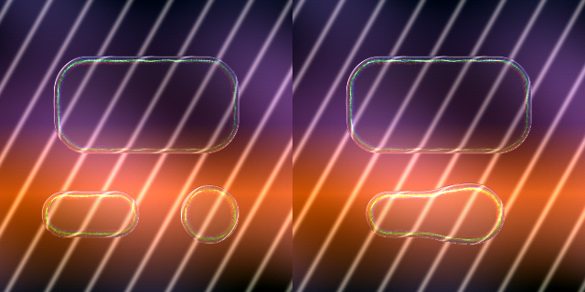

# Liquid Glass on Arduino

The material from the desktop studio, rebuilt for a microcontroller: no GPU, no
float unit assumed, and less RAM than one scanline of the original.



*320×320 host preview. Left: three separate shapes, each with light running the
whole way round its fillet. Right: two of them merged — one silhouette, one
continuous ray path through the neck.*

## Run it

```
arduino/LiquidGlass/          open LiquidGlass.ino in the IDE, pick a board, flash
arduino/host/                 make && ./preview        same renderer, writes a PNG
```

The host build compiles the identical `lg_*.cpp` files the sketch does — no
shims, no float substitutions — so what the preview writes is what the panel
gets, bit for bit. Tune there, flash once.

```
./preview --size 320 320 --frames 8 --out anim
./preview --gain 2.0 --disp 5 --decay 0.99 --bounce 0.1
make tiny                     # rebuild at the Uno budget, to check it still fits
```

## Display

The sketch does not own your pins. Pick a driver at the top of
`LiquidGlass.ino`:

| `LG_DRIVER` | Configure where |
| --- | --- |
| `LG_DRIVER_TFT_ESPI` (default) | TFT_eSPI's own `User_Setup.h` |
| `LG_DRIVER_ADAFRUIT` | the `Adafruit_ST7789(...)` constructor in the sketch |
| `LG_DRIVER_NONE` | nothing — renders and reports fps over serial |

Frames are produced `LG_STRIPE_H` rows at a time and handed to a callback, so
peak RAM is `width × LG_STRIPE_H × 2` bytes whatever the panel's height. Any
`Adafruit_GFX` panel works; anything with an FPU will be pleasant.

## What changed from the shader

Two things, both forced by the hardware and both ending up closer to the
physics rather than further from it.

**The background is a function, not a texture.** `engine.py` needs two passes
because its glass samples a texture that must already contain the wallpaper.
Here `bg(x, y)` is evaluated on demand, so a refracted sample is just another
call — no framebuffer, no second pass, no mipmap. The default is a dusk
gradient with broad ribbons and hairline caustics, picked for the same reason
the desktop build ships Golden Gate: the lens needs high-frequency detail to
compress at the rim or there is nothing to see. `lg_bg_set_image()` takes an
RGB565 bitmap instead.

The adaptive body tint wants a very wide blur of the wall behind it. The
shader takes mip 7; here the gradient *is* the low-frequency content by
construction, so its luma is the answer directly and the blur disappears.

**Dispersion is traced, not integrated.** This is the substantial one.

The shader gets its spectral fringe by sampling the background eight times per
pixel, once per wavelength, each at a slightly different displacement. That is
eight dependent texture fetches for every pixel of every rim — nothing on a
GPU, completely out of reach here.

So it is turned inside out. Instead of asking every pixel what colour the light
arriving at it separated into, trace the light:

* the rim of the glass is a fillet, a quarter-round rolling from the flat top
  down to the silhouette, and **a filleted glass edge is a light pipe**. Light
  coupling in near the silhouette travels almost along the surface, hits the far
  wall well past the critical angle, totally internally reflects, and stays
  trapped;
* trapped light follows the pipe, and the pipe follows the outline — around the
  corners, along the straights, all the way around. It is why a real glass edge
  glows along its whole length from one light source;
* every reflection and every bit of curvature bends the bundle, and the index
  of refraction is wavelength-dependent, so each bend separates the wavelengths
  further. The fan widens with distance travelled: tight where the light couples
  in, a full spectrum by the time it has rounded a corner.

Per ray the tracer seeds on the merged silhouette, steps along the tangent,
projects back onto an isocontour of the field — which is what pins the path
inside the fillet and makes it inherit the curve — and oscillates that
isocontour to zig-zag between the pipe's walls. Rays seed in both directions,
because light entering a pipe propagates both ways round it, and the fan is
expanded into `LG_RAY_BANDS` wavelengths offset across the pipe at draw time.

The wall-bounce is a stand-in for solving Snell at each reflection, not a
derivation of it: it produces the right bounce spacing and the right shimmer for
a tenth of the arithmetic. Everything else in the list is the real mechanism.

Cost stops depending on resolution and starts depending on how many rays you
ask for, which is a number you control.

**Left out:** frost and the drop shadow, both zero in every shipped desktop
preset. Heavy backdrop blur is the iOS 15–18 look Apple moved away from and is
what makes a render read as fogged plastic; the rim hairline carries the
separation on its own. There is no reason to spend a 16-tap disk blur here
reproducing something the desktop build turns off.

Everything else is a line-for-line port: the smooth-min SDF field, the circular
bevel profile, the two-light specular gated to the outer bevel, the adaptive
tint, the Fresnel term, the hairline.

## Arithmetic

Q16.16 fixed point throughout — one format everywhere, no float library linked
in, identical results on every board. `lg_fixed.h` has the whole of it: the
64-bit-intermediate multiply, a restoring integer square root, a `hypot` that
never forms a Q16.16 square (which would overflow past 181px), sine as a
minimax polynomial over turns so wrapping is a bitwise AND, and `exp(-x)` for
the falloffs.

565 output gets a 4×4 ordered dither. A dusk gradient across 32 blue levels
bands badly, and it bands exactly where the lens is compressing the background —
right at the rim, where it reads as a rendering fault rather than a display
limit.

## Budget

`lg_config.h` picks defaults from the MCU. `LG_TIER` overrides the detection.

| | tier 0 (Uno) | tier 1 (Mega) | tier 2 (ESP32/RP2040/Teensy) |
| --- | --- | --- | --- |
| max width | 160 | 240 | 320 |
| stripe rows | 2 | 6 | 16 |
| rays × bands | 10 × 3 | 24 × 5 | 72 × 7 |
| static RAM | 1236 B | 4756 B | 18228 B |

Static RAM measured with `size -A` on the tier-built objects. Tier 0 fits an
Uno's 2KB and renders — see `make tiny` — but with ten rays the edge colour is
sparse rather than continuous, and a 16MHz AVR synthesising 64-bit multiplies
will take seconds per frame. It is a demonstration that the port is honest
about its arithmetic, not a recommendation.

Frame cost on tier 2 is dominated by the per-pixel field evaluation (five
evaluations per glass pixel, each looping every shape) and by the procedural
background. Rows with no shape near them skip the field entirely, which on a
typical scene is most of the frame.

**Not measured on hardware.** The host preview renders 320×320 in ~75 ms on a
desktop x86 build; that number says nothing useful about an ESP32. Flash it
with `LG_DRIVER_NONE` and read the fps line off the serial port.

## Files

| File | What it does |
| --- | --- |
| `LiquidGlass.ino` | display driver choice, scene loop, fps report |
| `lg_fixed.h` | Q16.16 scalar math |
| `lg_config.h` | per-board RAM and quality budget |
| `lg_scene.h` | shape model and material parameters |
| `lg_field.*` | SDFs, smooth-min field, normals, isocontour projection |
| `lg_bg.*` | procedural wall, optional RGB565 bitmap, ambient level |
| `lg_rays.*` | the fillet light-pipe tracer and its spectral fan |
| `lg_render.*` | lens shading and the stripe loop |
| `lg_demo.*` | the demo scene, shared with the host preview |
| `host/` | desktop build: same sources, writes PNGs |

Parameter names in `LGParams` match the shader's uniforms one-for-one, so a
value tuned in the desktop studio can be typed straight in.
