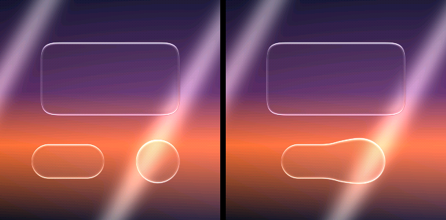

# Liquid Glass on Arduino

The material from the desktop studio, on a microcontroller. Not an impression of
it: `shaders.py`'s `GLASS_FRAG` translated line for line into float, with
`engine.py`'s two passes and the two-lobe hairline from the WebGL build.



*320×320, written by `host/preview`. Left: three shapes, each with the hairline
running the whole way round its fillet. Right: two of them merged — one
silhouette, one continuous line through the neck, and the card above keeping its
own outline because joining is opt-in per shape.*

## Run it

```
arduino/LiquidGlass/          open LiquidGlass.ino in the IDE, pick a board, flash
arduino/host/                 make && ./preview        same renderer, writes a PNG
```

The host build compiles the identical `fg_*.cpp` files the sketch does — no
shims, no float substitutions, the same `-ffp-contract=off -fno-fast-math` — so
what the preview writes is what the panel gets. Tune there, flash once.

```
./preview --size 480 320 --frames 8 --out anim
./preview --content                 # engine.py's content pass, not its UI pass
./preview --ss 2                    # supersample, which is all a DPR is
./preview --noopt                   # the unoptimised renderer, for comparison
make exact                          # upstream's 8 taps and trilinear mips
make webgl                          # match the WebGL build's corner and ambient
```

## Display

The sketch does not own your pins. Pick a driver at the top of
`LiquidGlass.ino`:

| `LG_DRIVER` | Configure where |
| --- | --- |
| `LG_DRIVER_TFT_ESPI` (default) | TFT_eSPI's own `User_Setup.h` |
| `LG_DRIVER_ADAFRUIT` | the `Adafruit_ST7789(...)` constructor in the sketch |
| `LG_DRIVER_NONE` | nothing — renders and reports ms/frame over serial |

Frames are produced 8 rows at a time and handed to a callback, so the output
path costs `width × 8 × 2` bytes whatever the panel's height. Any
`Adafruit_GFX` panel works. Panels wider than 1280 px do not: the stripe buffer
is sized for that and `fg_render_region` declines a wider window rather than
overrun it.

## What this is a port of

This repository contains the same material three times. The port reads all
three and follows the desktop build, because that is the one the studio ships.

| | where | what it contributes here |
| --- | --- | --- |
| `shaders.py` `GLASS_FRAG` | root of `main` | the material, line for line |
| `engine.py` | root of `main` | the two passes: content over wallpaper, UI over the composed scene |
| `app.py` `content_params()` / `ui_params()` | root of `main` | which dials each pass gets |
| `webgl/winliqglass.js` | branch `webgl` | the two-lobe hairline, and `abs(uBend)` |
| `presets.md`, `demo/video.html` | branch `webgl` | the "Movie" preset, applied once |

The preset is `setDirection(-1)`, `setIntensity(0.14)`, `setMaterial({bend:
0.52})`, `setHighlight({angle: 0, bounce: 0.85, strength: 2.3, specular: 2.6,
sharpen: 0.42, base: 0.14})`, exactly as `demo/video.html` sets it.
`fg_params_movie()` is that arithmetic done once, and **nothing is tuned per
widget**. Per-kind opacity and tint tuning is what made the first attempt at
this port read as liquid *opaque*; the preset is applied and left alone.

### Where the two upstream builds disagree

A whole-file diff of `shaders.py` `GLASS_FRAG` against `webgl/winliqglass.js`
`FRAG` finds exactly four material differences, and no more:

1. the desktop build gives rrects a **continuous (squircle) corner**; the WebGL
   build's `sdRRect` has no such branch;
2. the desktop build **leaks the ambient mip's hue** into the body tint
   (`adapt += (ambCol - amb) * 0.15`); the WebGL build takes only its luma;
3. the WebGL build takes `abs(uBend)` for `aaLod` **and** for the dispersion
   spread; the desktop build uses the raw `uBend`;
4. the WebGL build has the **two-lobe hairline**; the desktop build has one lobe.

(3) and (4) are settled in the WebGL build's favour, because they are the only
forms that work with this preset: under `direction = -1` the desktop form makes
`clamp(uBend / 60, 0, 1.6)` exactly zero — no spectral dispersion at all — and
asks for `log2` of a negative number. One hairline lobe reads as a sticker with
a bright corner.

(1) and (2) are a real choice, so they are compile-time switches with the
**desktop behaviour as the default**: `FG_CORNERS_CONTINUOUS` and
`FG_AMBIENT_HUE`. Upstream makes `SQUIRCLE` a `#define` for the same reason —
it is a statement about the shape language, not a per-frame parameter.

## What it was checked against, and how

The oracle is the real WebGL2 build in this repository, rendered headless and
diffed per channel, with **the same background pixels on both sides** — without
that qualifier you are mostly measuring the reference's own 8-bit wallpaper
against our RGB565 one. Mean |diff| per 255, over the glass region, before
quantisation:

| scene | shipped defaults | `-DFG_CORNERS_CONTINUOUS=0 -DFG_AMBIENT_HUE=0` |
| --- | --- | --- |
| one of each UI surface, 1280×720, one pass | glass 0.515, rim 1.471 | **glass 0.263, rim 0.326** |
| Control Centre, three passes | glass 1.742, rim 2.660 | glass 1.644, rim 1.472 |
| three discs over a video still, two passes | glass 1.698, rim 1.853 | glass 1.697, rim 1.851 |

On a full 1280×720 UI-layer frame with the corner matched, **mean |diff| is
0.245/255 and 99.47 % of all channel samples are within 0.5/255** of the real
WebGL2 renderer; 99.975 % within 1.0; p50 0.000, p99 0.479, max 2.574, and 101
samples of 2 764 800 exceed 1.5. A float quantised to the reference's own 8-bit
framebuffer has a mean error of 0.25, so **0.245 is the reference's output step,
not a residual of the port.** The rim column is entirely the corner. The
multi-pass rows carry one extra RGB565 quantisation per pass, about 0.74/255,
because our scene texture is 565 where the library's is RGBA8.

Those numbers were measured with these `fg_*.cpp` files, on the UI they were
written for rather than on the demo scene here.

## Three things this port got wrong first

Worth writing down, because each was invisible until it was measured against
the real renderer, and two of them are traps any port of this shader will hit.

**Device pixel ratio is supersampling, and nothing else.** `resize(w, h, dpr)`
sets the CSS box to `w × h` and the backing store to `w·dpr × h·dpr`; the
fragment shader runs per backing-store pixel but works in CSS coordinates, and
the compositor resolves the backing store down. Treating DPR as a coordinate
scale — dividing the layout by 2.5 — multiplies every pixel-denominated dial by
2.5 relative to a shape, which is a material-strength change wearing a
resolution change's clothes. The reference build settles it: DPR 1 against DPR
2.5 differs on 0.37–0.50 % of pixels, max 20–26/255, all of it in the bevel.
Correcting this took one disc's rim strip from **50.22/255 to 3.55/255**. Here,
`FG_SS` is the sample count per axis and shape coordinates go in unscaled.

**The mip pyramid has to follow GL's rule for odd sizes.** `textureLod(uBg, uv,
7.0)` feeds the adaptive body tint, so the pyramid is not a detail. Two halves
of one convention were wrong. A plain 2×2 box **drops the last row or column**
when a dimension is odd — GL's Manual Mipmap Generation (GL 4.6 §8.14.4 /
`ARB_texture_non_power_of_two`, inherited by ES 3.0) uses a weighted 3-tap
there; over the eight halvings of a 960×400 frame the two rules' level 7 differ
by 0.0507 in mean luma, which the adaptive tint turns into a cast over the
interior of every shape. And `levelSize` is the level's **own** size, not
`level0 × 2⁻ᴸ`: level 7 of 400 rows is 3, not 3.125, so every deep fetch was
stretched by up to 7 %. Each fix alone is worse than neither. Together, against
the WebGL2 renderer: glass 2.022 → **1.636**, body 2.077 → **1.611**.

Every level is stored as RGB565, like the source, and that was re-priced rather
than assumed: reducing from the parent's unquantised values is worth 0.01/255,
and unquantised level *storage* — six times the bytes per fetch — is worth
0.06/255. On a part where a texture fetch is four random texels out of external
RAM, the pyramid's width in bytes is what the fetch costs, so 565 stays. Level 0
is the source buffer itself, so the exact source pixels stay the source pixels.

**A culled shape is governed by the *other* shapes' merge radius.** Found while
packaging this port. `field_sub()` folds shape *j* in with `smin(d, dⱼ, kⱼ)` —
the k of the shape being added, applied to an accumulator that already carries
every earlier shape. So an earlier shape stops mattering only once it clears the
running minimum by the k of every `smin` still to come, not by its own. The
bound used its own, which is too tight the moment a scene mixes merge settings:
in the demo here a `merge = 0` card (k = 1) got a bound 34 px narrower than the
`merge = 1` pill that would later blend it at k = 34.67, and dropping it moved
the field — **290 pixels differing from `--noopt`, max 148/255**, a visible
notch in the join. The bound now takes the scene's largest k. Widening a cull
bound can only put shapes back, so it is safe by construction, and where every
shape shares one k it is the same number as before; every scene the fidelity
table above was measured on has `merge = 0` throughout, so those numbers are
unaffected.

### How exact the two optimisations actually are

The renderer culls per row and takes a fast path through shape interiors. Both
default on, and `--noopt` turns both off. Measured over eight demo frames,
comparing the pre-quantisation floats rather than the 565 output:

| | against the unoptimised path |
| --- | --- |
| interior fast path | **bit-identical** — every float of every pixel |
| per-row active-shape list | exact in arithmetic, **not** bit-identical: ~4 300 of 307 200 floats differ, by at most **0.026/255** |

`smin` is a fold, and float addition is not associative, so changing which
shapes are in the fold changes the rounding even where it cannot change the
value. 0.026/255 is three orders below the RGB565 step the output is quantised
to; it is worth at most one flipped 565 pixel per frame, and at 320×320 that is
what it costs: one pixel in four of the eight frames.

## Budget

The material needs a **background texture with a mip pyramid**. That is the
honest cost of dropping the fixed-point tree, which evaluated its wallpaper as a
function and approximated the wide ambient mip with a 4×4 luma grid. Measured,
by instrumenting the allocator:

| panel | level 0 | mip levels | total | levels |
| --- | --- | --- | --- | --- |
| 240×240 | 115 200 B | 38 368 B | **150 KB** | 8 |
| 320×240 | 153 600 B | 51 176 B | **200 KB** | 9 |
| 320×320 | 204 800 B | 68 260 B | **267 KB** | 9 |
| 480×320 | 307 200 B | 102 384 B | **400 KB** | 9 |

Plus 20 480 B for the stripe buffer, once. Nothing is static: every allocation
goes through `fg_mem_set_alloc()`, and a second hook takes levels of 16 KB or
less, which are the ones the body tint fetches for every glass pixel and are
worth internal RAM on a part that has both kinds. On an ESP32 the wall belongs
in PSRAM; the sketch does that for you when `BOARD_HAS_PSRAM` is defined.

**An AVR cannot run this**, and no tier system pretends otherwise. The floor is
a part with an FPU and a few hundred KB it can spare.

## Speed

This is a material, not an animation system. Render a surface once, keep the
pixels, redraw when something changes.

Host, x86-64, `g++ -O2`, 320×320, minimum of seven runs:

| build | ms/frame |
| --- | --- |
| shipped defaults | **19.1** (0.187 µs/px) |
| `--noopt` | 30.5 |
| `make exact` (8 taps, trilinear) | 22.1 |

Device, an M5Stack Tab5 (ESP32-P4, 360 MHz), measured per surface rather than
per frame — **36–39× this host per pixel**:

| surface | ms |
| --- | --- |
| toolbar pill, 150×52 | **145** |
| the same pill, re-rendered for a touch light | 147 |
| card, 960×96 | **1 505** |
| Control Centre panel, 460×420, frosted, sampling live content | **1 731** |
| five cards, cold / cached | 7 534 / 0 |

Those are with the shipped defaults. They are slow and they are what the
material costs on that part; the honest ways down from here are algorithmic,
not compiler flags. `-flto` is worth 1–2 %, measured — the cross-file call into
the sampler is not the cost.

## The switches

All are `-D` flags, all measured against the WebGL2 ground truth:

| flag | default | costs | buys |
| --- | --- | --- | --- |
| `FG_SPECTRAL_TAPS` | 6 | 0.108/255 on the harshest scene, 0.005 on a UI frame | 1.29–1.46× |
| `FG_TRILINEAR` | 0 | 0.139/255 on a video still, 0.039 on a UI frame | 1.51–1.58× |
| `FG_SPECTRAL_MOMENT` | 0 | 2.63/255 — five times the budget, and visible | 1.94× |
| `FG_CORNERS_CONTINUOUS` | 1 | — | the desktop corner, or the WebGL one at 0 |
| `FG_AMBIENT_HUE` | 1 | — | the desktop ambient, or the WebGL one at 0 |
| `FG_SS` | 1 | N² samples per pixel | supersampling, which is all a DPR is |

`-DFG_SPECTRAL_TAPS=8 -DFG_TRILINEAR=1` restores upstream's sampling
bit-identically. Six taps is the pick inside the qualifying set rather than
four, because the midpoint quadrature's *span* narrows as N falls (±0.4167 of
the spread at 6 against upstream's ±0.4375, but ±0.375 at 4) — six keeps the
fringe the same width and samples it more coarsely, where four would be a
systematic narrowing dressed up as noise.

## What happened to the old port

The tree here was Q16.16 fixed point, and it replaced every part of the shader a
small MCU could not afford. It was honest arithmetic and it did not look like
the material:

| | the fixed-point tree | this one |
| --- | --- | --- |
| arithmetic | Q16.16 throughout, no float library | float |
| background | a procedural function, or a cover-fitted bitmap, nearest | a texture with a mip pyramid, bilinear + lod |
| ambient tint | a 4×4 luma grid | `textureLod(uBg, uv, 7.0)`, with its hue |
| dispersion | rays traced around the fillet, drawn additively | 8 spectral taps per pixel, residual split, chromatic part amplified |
| corners | squircle, capped at 150 px by the fixed-point range | squircle, unconditional |
| hairline | one lobe | the WebGL two-lobe pair |
| layers | one pass | `engine.py`'s two |
| runs on | an Uno, slowly | anything with an FPU and ~200 KB |

The ray tracer was a good idea — a filleted glass edge really is a light pipe,
and tracing it really is cheaper than integrating per pixel. It is not in this
port, and neither is the tier system, `lg_fixed.h`, or the procedural-wall
plumbing. If you want them, they are in this repository's history; this
directory now carries one thing, which is the studio's material.

The demo wall is the one piece that survived: `fg_demo.cpp` is the old
`lg_bg.cpp` dusk gradient with its constants unchanged, in float, baked into a
texture. The reasoning behind it is unchanged too — the lens has nothing to show
unless the wall has something to compress, which is also why the desktop build
ships Golden Gate.

## Files

| File | What it does |
| --- | --- |
| `LiquidGlass.ino` | display driver choice, wall bake, scene loop, timing report |
| `fg_glass.h` | scene and parameter model, and every compile-time switch |
| `fg_shader.cpp` | `GLASS_FRAG`, line for line: SDFs, field, refraction, lighting, hairline |
| `fg_render.cpp` | the Movie preset, culling bounds, the stripe loop, 565 + dither |
| `fg_tex.cpp`, `fg_tex.h` | `sampler2D` with mips: the pyramid, bilinear, `textureLod` |
| `fg_demo.*` | the demo wall and scene, shared with the host preview |
| `host/` | desktop build: same sources, writes PNGs |

`FGParams` is one-to-one with `GLASS_FRAG`'s uniform block, so a value tuned in
the desktop studio can be typed straight in.
